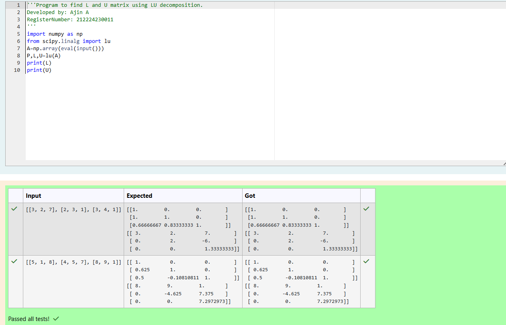
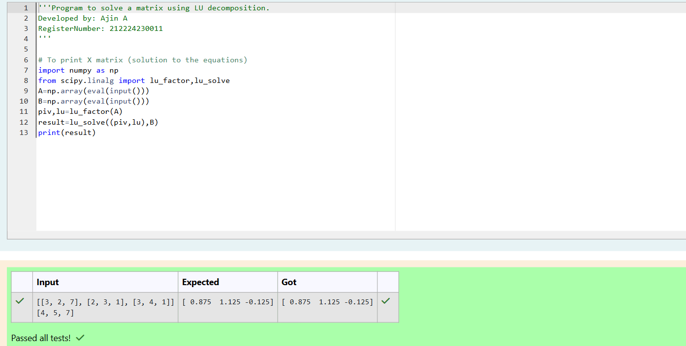

# LU Decomposition 

## AIM:
To write a program to find the LU Decomposition of a matrix.

## Equipments Required:
1. Hardware – PCs
2. Anaconda – Python 3.7 Installation / Moodle-Code Runner

## Algorithm
### (i) To Find the L and U Matrices

1.Start

2.Import necessary libraries: numpy as np, and lu from scipy.linalg.

3.Prompt the user to enter a matrix A.

4.Convert the user input into a NumPy array.

5.Perform LU decomposition using lu(A) and store the result in P, L, and U.

6.Display the lower triangular matrix L.

7.Display the upper triangular matrix U.

8.End

### (ii) To Find the LU Decomposition and Solve a System

1.Start

2.Import necessary libraries: numpy as np, and lu_factor, lu_solve from scipy.linalg.

3.Prompt the user to enter a matrix A and a vector b.

4.Convert the inputs into NumPy arrays.

5.Use lu_factor(A) to compute the LU decomposition of matrix A, resulting in lu and piv.

6.Solve the system Ax = b using lu_solve((piv, lu), b) and store the result in result

7.Display the solution .

8.End

## Program:
(i) To find the L and U matrix

```python
'''Program to find L and U matrix using LU decomposition.
Developed by: Ajin A
RegisterNumber: 212224230011
'''
import numpy as np
from scipy.linalg import lu
A=np.array(eval(input()))
P,L,U=lu(A)
print(L)
print(U)

```
(ii) To find the LU Decomposition of a matrix

```python
'''Program to solve a matrix using LU decomposition.
Developed by: Ajin A
RegisterNumber: 212224230011
'''

# To print X matrix (solution to the equations)
import numpy as np
from scipy.linalg import lu_factor,lu_solve
A=np.array(eval(input()))
B=np.array(eval(input()))
piv,lu=lu_factor(A)
result=lu_solve((piv,lu),B)
print(result)

```

## Output:






## Result:
Thus the program to find the LU Decomposition of a matrix is written and verified using python programming.

